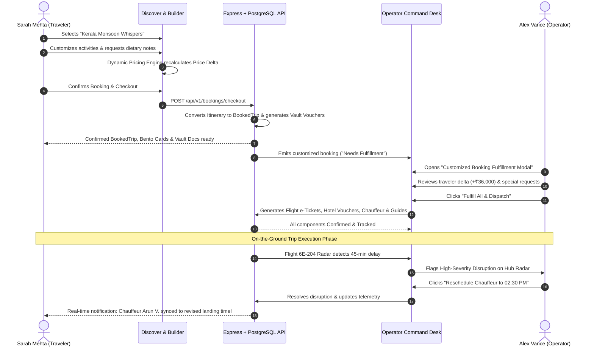

# TripFlow — Complete Feature & Technical Specification

> **Platform:** TripFlow — Next-Generation Luxury Travel Concierge & Real-time Operations Command Platform  
> **Architecture:** Dual-Surface Web Application (Consumer Traveler Portal + Operator Command Hub)  
> **Frontend Stack:** React 19, TypeScript, Vite, Tailwind CSS, Material Symbols  
> **Backend Stack:** Node.js (TypeScript), Express.js, PostgreSQL (Neon / Prisma ORM)  
> **AI Services:** Google Gemini API (`@google/genai` — `gemini-2.5-flash` & `gemini-1.5-pro`)  
> **Media & Storage:** Cloudinary CDN (Signed cryptographic uploads, authenticated private URLs)  
> **Real-Time Telemetry:** Live Flight Radar (ADS-B), Chauffeur GPS, and Interactive Disruption Resolution Dispatch  

---

## Table of Contents
1. [Platform Overview & Dual-Surface Concept](#1-platform-overview--dual-surface-concept)
2. [User Personas & Role-Based Access Control](#2-user-personas--role-based-access-control)
3. [End-to-End System Flow & Cross-Surface Synergy](#3-end-to-end-system-flow--cross-surface-synergy)
4. [Consumer Surface Features (Traveler Experience)](#4-consumer-surface-features-traveler-experience)
   - 4.1 [Landing Page & Guest Entryway](#41-landing-page--guest-entryway)
   - 4.2 [Authentication & Profile Management](#42-authentication--profile-management)
   - 4.3 [Home & Live Concierge Portal](#43-home--live-concierge-portal)
   - 4.4 [Discover Screen & Curated Circuits](#44-discover-screen--curated-circuits)
   - 4.5 [Living Itinerary Builder & Dynamic Pricing Engine](#45-living-itinerary-builder--dynamic-pricing-engine)
   - 4.6 [Trips, Bookings & Bento Logistics Hub](#46-trips-bookings--bento-logistics-hub)
   - 4.7 [Travel Vault & Gemini Optical OCR Scanner](#47-travel-vault--gemini-optical-ocr-scanner)
5. [Operator Surface Features (Operations Command Hub)](#5-operator-surface-features-operations-command-hub)
   - 5.1 [Operations Cockpit & Live Telemetry Radar](#51-operations-cockpit--live-telemetry-radar)
   - 5.2 [Tour Packages Studio & Dynamic Circuit Publisher](#52-tour-packages-studio--dynamic-circuit-publisher)
   - 5.3 [Master Bookings Manifest & Customized Booking Fulfillment](#53-master-bookings-manifest--customized-booking-fulfillment)
   - 5.4 [Flight Bookings & e-Ticket Management](#54-flight-bookings--e-ticket-management)
   - 5.5 [Stay & Hotel Bookings Management](#55-stay--hotel-bookings-management)
   - 5.6 [Chauffeur & Fleet Transfer Management](#56-chauffeur--fleet-transfer-management)
   - 5.7 [Activity & Experience Fulfillment](#57-activity--experience-fulfillment)
   - 5.8 [Tour Cohorts & Live Tour Detail Controller](#58-tour-cohorts--live-tour-detail-controller)
   - 5.9 [Tour Guides & Staff Directory](#59-tour-guides--staff-directory)
   - 5.10 [Vendor Supply Network & SLA Governance](#510-vendor-supply-network--sla-governance)
   - 5.11 [Itinerary Disruption Alerts & Resolution Engine](#511-itinerary-disruption-alerts--resolution-engine)
   - 5.12 [Payments Ledger, Escrow & Treasury](#512-payments-ledger-escrow--treasury)
   - 5.13 [Global Operations Calendar](#513-global-operations-calendar)
6. [Backend Architecture, Database Schema & API Modules](#6-backend-architecture-database-schema--api-modules)
   - 6.1 [PostgreSQL Relational Schema (Prisma Models)](#61-postgresql-relational-schema-prisma-models)
   - 6.2 [RESTful API Endpoints Specification](#62-restful-api-endpoints-specification)
   - 6.3 [Google Gemini AI Integrations](#63-google-gemini-ai-integrations)
   - 6.4 [Cloudinary Media & Cryptographic Vault Security](#64-cloudinary-media--cryptographic-vault-security)
7. [Technology Stack Matrix](#7-technology-stack-matrix)

---

## 1. Platform Overview & Dual-Surface Concept

TripFlow is an enterprise-grade luxury travel management platform engineered to resolve the friction between high-touch bespoke travel planning and real-time on-the-ground execution. Unlike traditional Online Travel Agencies (OTAs) that disconnect booking from operations, TripFlow functions as a **synchronized dual-surface platform**:

```
┌────────────────────────────────────────────────────────────────────────┐
│                        TRIPFLOW DUAL-SURFACE                           │
├───────────────────────────────────┬────────────────────────────────────┤
│         CONSUMER SURFACE          │          OPERATOR SURFACE          │
│       (Traveler / Client)         │      (Tour Operations & Dispatch)  │
├───────────────────────────────────┼────────────────────────────────────┤
│ • Discover & Curated Circuits     │ • Operations Command Hub (Radar)   │
│ • Living Itinerary Builder        │ • Tour Packages Studio             │
│ • Dynamic Real-Time Pricing       │ • Traveler Customization Engine    │
│ • Bento Logistics (Flight/Car/Stay│ • Flights, Stays, Transfer Logs    │
│ • Encrypted Offline Travel Vault  │ • Staff & Guide Dispatch           │
│ • Gemini Optical OCR Scanner      │ • Vendor Contracts & SLAs          │
│ • 24/7 Concierge WhatsApp Link    │ • Real-time Disruption Resolution  │
└───────────────────────────────────┴────────────────────────────────────┘
                               ▲                      ▲
                               │                      │
                               ▼                      ▼
┌────────────────────────────────────────────────────────────────────────┐
│                 SHARED EVENT & DATA SYNCHRONIZATION                    │
│   (Neon PostgreSQL + Prisma ORM + Gemini 2.5 Flash + Cloudinary)       │
└────────────────────────────────────────────────────────────────────────┘
```

When a traveler selects, customizes, and books a package on the consumer surface, the order is instantly ingested by the operator command suite as a customized fulfillment requirement. When unexpected real-world events occur (such as a flight delay or landslide), operators can resolve the disruption from their dispatch console, immediately pushing corrected telemetry, updated chauffeur pickup times, and rescheduled itineraries to the traveler's phone.

---

## 2. User Personas & Role-Based Access Control

The platform provides dedicated interfaces, security contexts, and mock identities:

### 2.1 Traveler Persona: Sarah Mehta
* **Role:** `TRAVELER`
* **Title:** Concierge Elite Member
* **Avatar & Profile:** Pre-loaded with VIP status, active trip data (Kerala Monsoon Whispers, 6 Days), linked payment cards, and synchronized encrypted documents.
* **Context:** High-net-worth individual requiring private chauffeur transport, boutique luxury accommodations, bespoke culinary arrangements, and zero logistics friction.

### 2.2 Operator Persona: Alex Vance
* **Role:** `OPERATOR`
* **Title:** Chief Dispatch Controller
* **Access Level:** Operator Command Hub, Fleet Dispatch Radar, Tour Cohorts, Vendor Supply Contracts, Payments Ledger, Disruption Management.
* **Context:** Responsible for managing 18 active tour cohorts, 42 ground travelers, on-time SLA metrics, vendor contract compliance, and resolving flight/weather disruptions.

### 2.3 Guest / Unauthenticated Traveler
* **Access:** Landing page, curated packages discovery, public pricing, and interactive builder preview before checkout.

---

## 3. End-to-End System Flow & Cross-Surface Synergy

TripFlow connects consumer choices to operational dispatch through an unbroken loop:



---

## 4. Consumer Surface Features (Traveler Experience)

### 4.1 Landing Page & Guest Entryway
* **Atmospheric Visuals:** High-fashion luxury editorial aesthetic featuring dark midnight accents (`#111827`, `#0F172A`), rich emerald and gold highlights, smooth CSS backdrop blur, and fluid typography.
* **Hero Section:** Value proposition headline, live telemetry demonstration badge, and multi-path entry points:
  * **"Explore Traveler Demo"**: Quick-launches Sarah Mehta’s live active journey with live telemetry.
  * **"Launch Operator Hub"**: Quick-launches Alex Vance’s Operations Cockpit.
  * **"Open Itinerary Builder"**: Directly opens the interactive canvas to design a bespoke journey.
* **Curated Showcase:** Interactive destination cards featuring domestic and international circuits with dynamic pricing, day counts, and luxury highlights.
* **Platform Pillars:** Dedicated feature spotlights detailing the Living Itinerary Canvas, Biometric Travel Vault, Real-time Ground Telemetry, and 24/7 Human Concierge.
* **Social Proof & Testimonials:** Verified reviews from VIP travelers highlighting personalized arrangements and seamless disruption handling.

### 4.2 Authentication & Profile Management
* **Role-Based Authentication Modal & Full-Page Auth Screen:**
  * Toggle between **Traveler** and **Operator** login credentials with pre-filled 1-click test credentials for instant evaluation.
  * Register new accounts with full profile metadata, travel preferences, and contact details.
  * Persistent session state integrated with JWT token headers for backend communication.
* **Traveler Profile Modal:**
  * Access membership tier details (*Concierge Elite Member*), passport number, emergency contact phone, and avatar.
  * Seamless role-switching button allowing instant switching between Consumer Mode and Operator Mode for testing and administration.
  * Direct deep links to Preferences, Travel Vault, Concierge WhatsApp, and Sign Out.
* **Preferences Drawer:** Configure dietary requirements (Jain, Vegan, Halal), preferred airline seats (Window/Aisle), vehicle preference (Executive SUV vs Luxury Sedan), and language preference.

### 4.3 Home & Live Concierge Portal
* **Personalized Welcome Greeting:** Context-aware time-of-day greeting for the authenticated user.
* **Active Journey Banner:** Live status countdown for current active booking with destination hero imagery.
* **Immediate Next Leg Card:** Highlights current day milestone (e.g. *Chauffeur pickup at Kochi Airport T3* or *Tea Estate Private Trek*).
* **Quick Action Controls:**
  * **Offline GPS Navigation:** Direct routing to offline travel maps.
  * **Driver WhatsApp / Call:** One-tap direct communication with the assigned chauffeur (Arun V.).
  * **Concierge Priority Line:** 24/7 direct dial to dedicated tour manager.
* **Saved Journeys Carousel:** Visual bookmarks of dream destinations with cost, duration, and one-tap booking action.

### 4.4 Discover Screen & Curated Circuits
* **Atmospheric 3D Orbiting Cards:** Six floating international destination badges (Riyadh, Tokyo, New York, Seoul, Beijing, Delhi) with subtle floating animations surrounding the search experience.
* **Natural Language AI Search Bar:**
  * Conversational search input that translates free-form ideas into structured itineraries.
  * One-tap quick inspiration pills (*"Inspire me where to go"*, *"Create a new Trip"*, *"Find family hotels in Dubai"*).
* **Circuit Categorization:** Tabbed filtering for **All**, **Domestic (India)**, and **International** tours.
* **Pre-made Luxury Circuits:**
  * *Kerala Monsoon Whispers & Backwaters* (6 Days / 5 Nights)
  * *Imperial Rajasthan & Royal Palaces* (7 Days / 6 Nights)
  * *Goa Coastal Luxury & Catamaran Charter* (5 Days / 4 Nights)
  * *Kashmir Valley of Gold & Dal Lake Heritage* (6 Days / 5 Nights)
  * *Ladakh High Passes & Monasteries* (7 Days / 6 Nights)
  * *Swiss Alpine Panoramic Rail & Glacier Express* (6 Days / 5 Nights)
* **Curated Circuit Modal Preview:**
  * Hero gallery, verified guest rating, route stops breakdown.
  * Comprehensive inclusions list (flights, 5-star heritage hotels, dedicated chauffeurs, VIP passes).
  * Operator director attribution badge with license numbers.
  * **"Customize in Builder"** action that clones the circuit into the interactive editor.
* **Live Operator Sync:** Any new package published by an operator in the Operator Studio instantly appears live on the Discover screen.

### 4.5 Living Itinerary Builder & Dynamic Pricing Engine
* **Interactive Day-by-Day Canvas:**
  * Day selector pill bar with add/remove day capabilities.
  * Time-slot bucket organization: Morning, Afternoon, Evening, Night.
  * Drag-and-drop item re-ordering within days and across time slots.
* **Undo / Redo History Stack:** Full state time-travel enabling risk-free customization and rollback.
* **Activity Catalog Drawer & Bottom Sheet:**
  * Filterable catalog containing 5 distinct travel categories:
    * 🏨 **Hotels & Stays:** Boutique heritage villas, teak houseboats, luxury glamping.
    * 🚗 **Transfers & Fleet:** Executive SUVs, electric sedans, private airport fast-tracks.
    * 🎭 **Activities & Tours:** Tea plantation treks, wildlife warden safaris, catamaran charters.
    * 🍽️ **Dining:** Traditional banana-leaf feasts, private estate candlelight dinners.
    * 🧘 **Wellness & Experiences:** Ayurvedic rejuvenation treatments, private Kathakali shows.
* **Custom Item Creation Modal:**
  * Custom item title, category selector, price in INR, default duration, time slot, location, notes, and tags.
* **Item Detail Overlay:**
  * High-resolution image preview, pricing, user ratings, duration, transit mode to next destination (e.g. *15 km · 35 min via Private SUV*), editable personal notes, and removal action.
* **Dynamic Real-Time Pricing Engine:**
  * Real-time calculation of **Subtotal**, **Taxes & Regulatory Fees (10%)**, and **Concierge Service Fee**.
  * Dynamic **Per-Person** cost computation based on traveler party size.
  * **Price Delta Indicator:** Real-time animated badge (`+₹4,500` or `-₹2,000`) showing the exact price impact of every addition, deletion, or upgrade.
* **Modify Booked Trip Mode:**
  * When editing an already-booked trip, the builder tracks the `originalBookedPrice`, calculates the exact financial difference (Price Delta), and either charges an additional fee or issues an account credit upon saving.
* **Natural Language AI Assistant (`AIAssistantInput`):**
  * Type or speak natural language commands (e.g., *"Add a sunset cruise in Alleppey on Day 3"*, *"Upgrade hotel to a luxury suite"*, *"Swap Day 2 afternoon with a cooking class"*).
  * Backend AI parser modifies the board schedule automatically and provides instant feedback.
* **Checkout & Booking Summary Modal:**
  * Guest count selector, travel dates confirmation, full financial itemization, and one-click conversion to a confirmed `BookedTrip`.
  * Automatically populates the traveler's Bento Logistics, creates travel vouchers, and dispatches the customized order to the Operator Desk.

### 4.6 Trips, Bookings & Bento Logistics Hub
* **Unified Dual-View Switcher:** Toggle between **"Live Timeline & Bento Logistics"** and **"Bookings & Vouchers Directory"**.
* **Active Trip Selector:** Dropdown switcher allowing travelers to navigate between multiple active, upcoming, and completed journeys.
* **Bento Logistics Dashboard:**
  * ✈️ **Real-Time Flight Bento:** Airline code, flight number (IndiGo 6E-204), PNR reference (`K8X29Q`), departure/arrival terminals, gate assignment, extra legroom seats, baggage allowance, and live radar sync status.
  * 🏨 **Hotel Check-In Bento:** Property name (*Brunton Boatyard*), room type (*Sea Facing Heritage Suite*), check-in/out dates, early check-in flag, voucher code, address, and included perks (complimentary artisanal breakfast, sunset cruise).
  * 🚘 **Chauffeur & Fleet Bento:** Assigned driver name (*Arun V.*), contact phone, driver rating (*4.98/5*), vehicle model (*Toyota Innova Crysta KL-07-CD-8841*), pickup point, and live GPS tracking indicator.
  * 🛎️ **Priority Concierge Bento:** Dedicated concierge manager with direct WhatsApp and priority voice line links.
* **Interactive Disruption Simulation Banner:**
  * Demonstrates real-time incident handling: simulates a weather delay or landslide road closure.
  * When unresolved, shows an amber advisory warning with expected delay impact.
  * When resolved by the operator, transforms into a verified emerald card showing the rescheduled timeline and revised chauffeur arrival time.
* **Granular Day-by-Day Timeline (Days 1 to 6):**
  * Expandable daily schedule with time badges, category icons, VIP permit indicators, and interactive event detail modals.
* **Bookings & Vouchers Directory:**
  * Filterable voucher cards (All, Flights, Stays, Transfers, Experiences).
  * Digital voucher inspector with confirmation numbers, room amenities, and printable PDF voucher export.
  * **"Modify Trip in Builder"** button: Opens the booked trip in the builder with dynamic price recalculation.
  * **"View in Travel Vault"** button: Deep-links directly to the encrypted document vault.

### 4.7 Travel Vault & Gemini Optical OCR Scanner
* **Encrypted Travel Credential Vault:**
  * Secure repository for passports, visas, boarding passes, hotel confirmation slips, activity permits, transit passes, and insurance cards.
  * Trip filtering (*All Trips* vs *Specific Trip*) and instant keyword search (PNR, traveler name, document title).
* **Credential Status Verification:**
  * Badges for `Verified by TripFlow AI Optical OCR`, `Valid`, `Expiring Soon`, and `Offline Ready`.
* **Document Preview & Sharing Modal:**
  * Detailed metadata viewer showing extracted MRZ fields, seat numbers, gate assignments, and confirmation codes.
  * **Live QR Code Generator:** Automatically renders high-contrast scannable QR codes for airport security gates, hotel front desks, and catamaran boarding docks.
  * Temporary 1-hour signed Cloudinary download URLs.
  * 24-hour secure sharing link copied to clipboard.
* **24/7 Emergency Contacts Directory:**
  * Circuit doctor, local police, tourist embassy lines, and 24/7 concierge numbers with one-tap clipboard copy.
* **Offline Vault Bundle Export:**
  * One-click download of an AES-256 encrypted zip archive containing all credentials, offline maps, and PDF folios for use without internet access.
* **Manual Document Uploader:**
  * Upload custom PDF/PNG/JPG files with custom title, category tagging, document number, and expiry date.
* **Gemini Optical Vision OCR Scanner Modal (`DocumentScannerModal`):**
  * **Input Modes:** Upload digital document or use live device camera/webcam.
  * **Multimodal AI Analysis:** Transmits image Base64 to Google Gemini 2.5 Flash Vision.
  * **Automated Extraction:**
    * Automatic category detection (Flight Boarding Pass, Passport, Hotel Slip, Train Ticket).
    * Traveler name, document/passport number, issue/expiry dates.
    * Specific sub-fields (PNR, Flight number, Seat, Gate, Terminal, Class of Service, Hotel Room type).
    * Confidence score rating (e.g. `98% Confidence`).
    * AI Summary narrative explaining extracted contents.
  * **One-Click Save to Vault:** Directly injects the structured data into the traveler's permanent vault and database.

---

## 5. Operator Surface Features (Operations Command Hub)

### 5.1 Operations Cockpit & Live Telemetry Radar
* **Operational KPI Metric Cards:**
  * 👥 **Active Travelers on Ground:** Real-time count of guests currently in-destination.
  * ⏱️ **On-Time Dispatch SLA:** Operational performance tracking (98.4% On-Time).
  * 🛰️ **Active Fleet Tracking:** Live vehicles tracked via GPS across active circuits.
  * ⚠️ **Open Disruption Issues:** Live count of flight delays, weather issues, or road blocks.
  * 💰 **Revenue Under Management:** Live financial volume of managed bookings.
* **Global Command Palette (`⌘K` / `Ctrl+K`):**
  * Quick-search tours, travelers, PNRs, chauffeurs, and jump between operator tabs.
* **Live Radar & Telemetry Display:**
  * Visual status monitor tracking flight ADS-B radar, gate updates, and fleet locations.
* **Interactive Disruption Resolution Desk:**
  * Real-time disruption cards showing affected traveler, circuit, severity, and suggested operator actions.
  * **1-Click Quick Reschedule:** Automatically reschedules chauffeur pickup to match delayed flight landing times and emits updated telemetry to Sarah Mehta's mobile view.
  * **Approve Budget Delta:** 1-click authorization of emergency hotel upgrades or alternative transit costs.
  * **Reassign Chauffeur:** 1-click driver reassignment when vehicles experience technical issues.
* **Real-Time Telemetry Feed:** Filterable stream of ground updates (Flight landed, Chauffeur on site, Hotel check-in complete, Weather advisory).
* **Pending Customizations Badge:** Glowing notification alerting dispatchers whenever a traveler completes a customized booking needing vendor fulfillment.

### 5.2 Tour Packages Studio & Dynamic Circuit Publisher
* **Master Package Catalog:** Comprehensive management of all operator-curated tour circuits.
* **Preset One-Click Packages:** Instant creation of signature circuits (Kashmir, Ladakh, Swiss Alps, Kerala, Rajasthan, Goa).
* **Create Tour Package Modal:**
  * Circuit Title, Target Destination, Country, Domestic/International flag.
  * Total Days, Package Price in INR, Hero Cover Image URL, Promotional Tag.
  * Multi-stop Route Builder: add multiple cities with stop orders.
  * Package Inclusions Builder: flights, 5-star properties, dedicated chauffeurs, VIP passes.
  * Assigned Lead Operator Director and verified license number.
* **Live Publishing Pipeline:** Packages published here are instantly committed to the database and made visible on the traveler-facing Discover screen in real time.
* **Package Performance Metrics:** Total passenger volume, revenue generated, and traveler ratings per package.

### 5.3 Master Bookings Manifest & Customized Booking Fulfillment
* **Master Traveler Manifest:** Complete roster of all passenger reservations across tour packages.
* **Status Filtering:** All, Customized, Confirmed, Pending, Waitlist.
* **Customized Booking Fulfillment Engine (`CustomizedBookingFulfillmentModal`):**
  * Specifically highlights bookings where travelers altered activities, added hotel nights, or changed transport.
  * Displays baseline package price vs customized package price with exact calculated **Price Delta**.
  * Displays traveler custom requests (e.g., *Strict vegetarian gourmet meals, quiet high-floor suite, English-speaking driver*).
  * **Component Fulfillment Checklist:**
    * 🏨 Hotel Reservation Status
    * ✈️ Flight Ticket Status
    * 🚘 Chauffeur Dispatch Status
    * 🎟️ Activity Passes Status
    * 👨‍✈️ Lead Tour Guide Status
  * **Granular Component Confirmation:** Dispatch individual items or click **"Fulfill All & Dispatch"**.
  * Dispatches verified entries across respective operator tabs (Flights, Stays, Transfers, Activities) and confirms booking status.

### 5.4 Flight Bookings & e-Ticket Management
* **Airline Ticket Manifest:** Master directory of all scheduled flights across tour groups.
* **Search & Filters:** Search by PNR, passenger name, flight number, airline, or origin/destination.
* **Ticket Details:**
  * Airline carrier, flight code (e.g., *IndiGo 6E-204*, *Air India AI-682*).
  * PNR and 13-digit e-Ticket numbers with one-click clipboard copy.
  * Departure/arrival airports, times, baggage allowance (25 kg check-in + 7 kg cabin).
  * Seat assignments (e.g. *14A, 14B Premium*), class of service, and status (*Ticketed*, *Pending*, *Checked-in*).
* **Digital e-Ticket Inspector:** Full boarding pass folio view with QR codes and flight schedule details.

### 5.5 Stay & Hotel Bookings Management
* **Accommodation Inventory:** Tracking all boutique resorts, palace hotels, and private houseboats.
* **Voucher & Folio Management:**
  * Property name, destination, room category (*Heritage Suite*, *Luxury Teak Houseboat*).
  * Check-in and check-out dates, total room nights, guest pax count.
  * Confirmation code and Voucher Reference with one-click copy.
  * Included meal plans (*Breakfast Included*, *All Meals Gourmet*).
  * Status flags: *Confirmed*, *Guaranteed*, *Pending*.
* **Digital Stay Voucher Inspector:** Detailed hotel voucher sheet with check-in instructions and amenity checklists.

### 5.6 Chauffeur & Fleet Transfer Management
* **Ground Fleet Dispatch:** Real-time scheduling of private executive cars, SUVs, and luxury coaches.
* **Transfer Specifications:**
  * Traveler name, pickup point, dropoff destination, and scheduled departure time.
  * Assigned Chauffeur name and direct phone number.
  * Vehicle make and model (*Toyota Innova Crysta*, *Tata Nexon EV*, *Mercedes E-Class*).
  * License plate number with one-click copy.
  * Live flight radar synchronization: updates pickup times when flights are delayed.
  * Route transit distance and estimated driving duration.

### 5.7 Activity & Experience Fulfillment
* **Experiences Schedule:** Coordination of private guided tours, national park safaris, cultural shows, and boat charters.
* **Experience Metadata:**
  * Activity title, scheduled date and time slot.
  * Lead guide assignment (e.g. *Joseph M.*, *Mahaveer Singh*).
  * Guest count and special traveler dietary/mobility requirements.
  * Ticket voucher references and VIP permit verification.

### 5.8 Tour Cohorts & Live Tour Detail Controller
* **Tour Cohorts Overview:** Visual list of all group departures (Active In-Progress, Upcoming, Completed).
* **Cohort Metrics:** Pax count vs capacity, route progression percentage, current stop, next milestone, assigned lead guide.
* **Live Tour Detail Screen (`TourDetailScreen`):**
  * Interactive route progression tracker with completed, current, and upcoming city milestones.
  * Live chauffeur telemetry and location status.
  * Passenger manifest with VIP flags, room numbers, dietary notes, and flight links.
  * Disruption response console with simulated incident injection and one-click resolution.

### 5.9 Tour Guides & Staff Directory
* **Staff Directory:** Certified master guides, private concierges, licensed chauffeurs, and cultural specialists.
* **Guide Profiles:**
  * Full name, role, photo avatar, star rating (*4.98/5*), total completed tours.
  * Spoken languages (English, Malayalam, Hindi, French, German).
  * Official government tourism certifications and licenses.
  * Operational status: `Available`, `On Tour`, `Off-Duty`.
  * Direct contact phone numbers.

### 5.10 Vendor Supply Network & SLA Governance
* **Supply Partner Directory:** Management of external hotels, airlines, chauffeur fleet operators, and activity providers.
* **Vendor Contract Metadata:**
  * Vendor name, operational category (Hotel, Flight, Fleet, Dining, Experience), regional coverage.
  * Star rating and SLA compliance score (e.g. *99.4% SLA Compliance*).
  * Active contracted bookings count.
  * Primary contact person, phone, and email.
  * Contract renewal dates and status (`Active`, `Under Review`, `Suspended`).

### 5.11 Itinerary Disruption Alerts & Resolution Engine
* **Incident Management Console:** Centralized stream of operational risks and disruptions.
* **Severity Levels:** `CRITICAL`, `HIGH`, `MODERATE`, `RESOLVED`.
* **Disruption Categories:** Airline delays, severe weather warnings, road closures/landslides, medical emergencies.
* **Impact Analysis:** Automatically calculates affected traveler count and tour group references.
* **AI & Operator Corrective Actions:** Pre-calculated mitigation plans with one-click execution that pushes telemetry updates across the entire platform.

### 5.12 Payments Ledger, Escrow & Treasury
* **Financial Ledger & Transaction Log:**
  * Comprehensive journal of all inbound client payments, outbound vendor payouts, and escrow allocations.
  * Transaction reference numbers, date timestamps, payment method (Wire, Card, Corporate Escrow).
  * Transaction status: `SETTLED`, `PROCESSING`, `HELD`, `FAILED`.
* **Treasury Summary:** Total inbound revenue, vendor disbursements, escrow reserves, and net operating margin.
* **Export Capability:** Export complete financial ledger to CSV for corporate accounting.

### 5.13 Global Operations Calendar
* **Visual Operations Schedule:** Interactive calendar displaying all departures, arrivals, hotel check-ins, transfers, and VIP experiences.
* **Event Filtering:** Filter by event type (Transfers, Hotel Check-ins, Flights, Experiences) or specific tour group.
* **Event Detail Previews:** Click any event to inspect guest pax, time slot, location, and assigned staff.

---

## 6. Backend Architecture, Database Schema & API Modules

### 6.1 PostgreSQL Relational Schema (Prisma Models)

The backend data architecture is modeled in PostgreSQL with 13 relational tables and native JSONB columns for flexible logistics:

```prisma
// Core Roles & Status Enums
enum Role { TRAVELER, OPERATOR, ADMIN }
enum TripStatus { DRAFT, CONFIRMED, IN_PROGRESS, COMPLETED, CANCELLED }
enum VaultCategory { PASSPORT, VISA, FLIGHT, HOTEL, INSURANCE, ID, ACTIVITY, TRANSIT, PERMIT, EMERGENCY, OTHER }
enum ItineraryItemCategory { ACTIVITY, HOTEL, TRANSPORT, MEAL, EXPERIENCE }
enum AlertSeverity { CRITICAL, HIGH, MODERATE, RESOLVED }
enum PaymentStatus { SETTLED, PROCESSING, HELD, FAILED }

// 1. User & Authentication
model User {
  id              String           @id @default(uuid())
  email           String           @unique
  passwordHash    String
  name            String
  role            Role             @default(TRAVELER)
  avatarUrl       String?
  phone           String?
  membershipTier  String           @default("Concierge Elite Member")
  createdAt       DateTime         @default(now())
  updatedAt       DateTime         @updatedAt

  trips           TripItinerary[]
  bookedTrips     BookedTrip[]
  vaultDocuments  VaultDocument[]
  savedJourneys   SavedJourney[]
  transactions    PaymentTransaction[]
}

// 2. Itinerary Blueprint
model TripItinerary {
  id              String          @id @default(uuid())
  userId          String
  title           String
  destination     String
  country         String
  dates           String
  startDate       DateTime
  travelers       Int             @default(2)
  currency        String          @default("USD")
  totalPrice      Decimal         @db.Decimal(12, 2)
  heroImageUrl    String?
  isPremade       Boolean         @default(false)
  status          TripStatus      @default(DRAFT)
  createdAt       DateTime        @default(now())
  updatedAt       DateTime        @updatedAt

  user            User            @relation(fields: [userId], references: [id], onDelete: Cascade)
  routeStops      RouteStop[]
  days            ItineraryDay[]
  bookedTrip      BookedTrip?
}

// 3. Route Milestones
model RouteStop {
  id              String          @id @default(uuid())
  itineraryId     String
  stopOrder       Int
  city            String
  weatherInfo     String?
  hotelName       String?
  transitMode     String?

  itinerary       TripItinerary   @relation(fields: [itineraryId], references: [id], onDelete: Cascade)
}

// 4. Daily Schedule
model ItineraryDay {
  id              String          @id @default(uuid())
  itineraryId     String
  dayNumber       Int
  dateStr         String
  title           String
  subtitle        String?
  
  itinerary       TripItinerary   @relation(fields: [itineraryId], references: [id], onDelete: Cascade)
  items           ItineraryItem[]
}

// 5. Itinerary Activity / Transit Item
model ItineraryItem {
  id              String                 @id @default(uuid())
  dayId           String
  catalogItemId   String?
  title           String
  category        ItineraryItemCategory
  price           Decimal                @db.Decimal(10, 2)
  timeSlot        String
  duration        String?
  location        String
  description     String
  imageUrl        String
  rating          Decimal?               @db.Decimal(3, 2)
  reviewsCount    Int?                   @default(0)
  tags            String[]
  notes           String?
  transitToNext   Json?                  // { mode, duration, distance }

  day             ItineraryDay           @relation(fields: [dayId], references: [id], onDelete: Cascade)
  catalogItem     CatalogItem?           @relation(fields: [catalogItemId], references: [id], onDelete: SetNull)
}

// 6. Master Catalog Repository
model CatalogItem {
  id              String                 @id @default(uuid())
  title           String
  category        ItineraryItemCategory
  price           Decimal                @db.Decimal(10, 2)
  timeSlotDefault String
  duration        String
  location        String
  description     String
  imageUrl        String
  rating          Decimal                @db.Decimal(3, 2)
  reviewsCount    Int                    @default(0)
  tags            String[]
  isActive        Boolean                @default(true)
  createdAt       DateTime               @default(now())

  itineraryItems  ItineraryItem[]
}

// 7. Confirmed Booked Trip & Bento Logistics
model BookedTrip {
  id              String          @id @default(uuid())
  itineraryId     String          @unique
  userId          String
  bookingRef      String          @unique
  title           String
  destination     String
  dates           String
  duration        String
  travelers       Int
  totalPrice      Decimal         @db.Decimal(12, 2)
  currency        String          @default("USD")
  status          TripStatus      @default(CONFIRMED)
  bookedAt        DateTime        @default(now())
  heroImageUrl    String

  // Bento JSONB Logistics Payloads
  flightDetails   Json            // { airline, flightNumber, pnr, route, departureTime, arrivalTime, terminal, gate, seat, baggage, status }
  hotelCheckIn    Json            // { hotelName, roomType, checkInDate, checkInTime, checkOutDate, voucherRef, address, inclusions, nights }
  carDetails      Json            // { vehicleType, vehicleModel, licensePlate, chauffeurName, chauffeurPhone, chauffeurRating, pickupLocation, pickupTime, gpsTrackingActive }

  itinerary       TripItinerary   @relation(fields: [itineraryId], references: [id])
  user            User            @relation(fields: [userId], references: [id])
  vaultDocuments  VaultDocument[]
  transactions    PaymentTransaction[]
}

// 8. Encrypted Travel Vault Document
model VaultDocument {
  id              String          @id @default(uuid())
  userId          String
  tripId          String?
  bookedTripId    String?
  category        VaultCategory
  title           String
  travelerName    String
  documentNumber  String?
  issueDate       String?
  expiryDate      String?
  status          String          @default("verified")
  fileUrl         String          // Cloudinary secure_url
  filePublicId    String          // Cloudinary public_id
  fileType        String          // pdf | png | jpg | qr
  fileSize        String
  uploadedAt      DateTime        @default(now())
  notes           String?
  verifiedBy      String?         @default("TripFlow AI Optical OCR")
  offlineReady    Boolean         @default(true)
  fields          Json?           // Extracted MRZ, PNR, Gate, Seat, Room
  isEncrypted     Boolean         @default(true)

  user            User            @relation(fields: [userId], references: [id], onDelete: Cascade)
  bookedTrip      BookedTrip?     @relation(fields: [bookedTripId], references: [id], onDelete: SetNull)
}

// 9. Tour Cohort
model TourCohort {
  id              String          @id @default(uuid())
  name            String
  circuit         String
  dates           String
  leadGuideId     String?
  paxCount        Int
  maxPax          Int
  progressPercent Int             @default(0)
  currentStop     String
  nextMilestone   String
  status          String          @default("In Progress")
  vipCount        Int             @default(0)
  createdAt       DateTime        @default(now())

  leadGuide       TourGuide?      @relation(fields: [leadGuideId], references: [id])
  alerts          DisruptionAlert[]
}

// 10. Tour Guide Staff
model TourGuide {
  id              String          @id @default(uuid())
  name            String
  role            String
  languages       String[]
  rating          Decimal         @db.Decimal(3, 2)
  totalTours      Int             @default(0)
  status          String          @default("Available")
  location        String
  phone           String
  avatarUrl       String
  certifications  String[]

  cohorts         TourCohort[]
}

// 11. Vendor Supply Network
model Vendor {
  id               String         @id @default(uuid())
  name             String
  category         String
  region           String
  rating           Decimal        @db.Decimal(3, 2)
  slaCompliance    Int            @default(99)
  activeContracts  Int            @default(1)
  contactPerson    String
  phone            String
  email            String
  status           String         @default("Active")
  contractRenewal  DateTime
  imageUrl         String?

  transactions     PaymentTransaction[]
}

// 12. Disruption Incident Alert
model DisruptionAlert {
  id                 String       @id @default(uuid())
  cohortId           String?
  tourTitle          String
  severity           AlertSeverity
  title              String
  description        String
  affectedTravelers  Int
  category           String
  actionSuggested    String
  isResolved         Boolean      @default(false)
  resolvedAt         DateTime?
  resolvedBy         String?
  createdAt          DateTime     @default(now())

  cohort             TourCohort?  @relation(fields: [cohortId], references: [id], onDelete: SetNull)
}

// 13. Financial Payment Transaction
model PaymentTransaction {
  id              String          @id @default(uuid())
  transactionRef  String          @unique
  bookedTripId    String?
  vendorId        String?
  userId          String?
  party           String
  type            String          // inbound | outbound | escrow
  amount          Decimal         @db.Decimal(12, 2)
  currency        String          @default("USD")
  status          PaymentStatus   @default(SETTLED)
  paymentMethod   String
  description     String
  createdAt       DateTime        @default(now())

  bookedTrip      BookedTrip?     @relation(fields: [bookedTripId], references: [id])
  vendor          Vendor?         @relation(fields: [vendorId], references: [id])
  user            User?           @relation(fields: [userId], references: [id])
}
```

---

### 6.2 RESTful API Endpoints Specification

The Express.js API gateway exposes 40+ RESTful endpoints organized across 8 versioned modules:

| Module | Method | Endpoint | Description | Auth Scope |
| :--- | :--- | :--- | :--- | :--- |
| **Auth** | `POST` | `/api/v1/auth/register` | Register new traveler or operator user | Public |
| **Auth** | `POST` | `/api/v1/auth/login` | Authenticate with credentials and receive JWT | Public |
| **Auth** | `GET` | `/api/v1/auth/me` | Fetch authenticated user profile & membership | Private |
| **Discover** | `GET` | `/api/v1/discover/premade` | Fetch all verified pre-made circuits | Public |
| **Discover** | `POST` | `/api/v1/discover/ai-generate` | **Gemini AI** generates custom multi-day itinerary | Public / Private |
| **Itinerary** | `GET` | `/api/v1/catalog/items` | Fetch activities catalog with category filters | Public |
| **Itinerary** | `GET` | `/api/v1/itineraries/:id` | Fetch full itinerary with days and items | Private |
| **Itinerary** | `POST` | `/api/v1/itineraries` | Save a new draft itinerary | Private |
| **Itinerary** | `POST` | `/api/v1/itineraries/:id/recalculate` | Compute subtotal, taxes, concierge fees, price delta | Private |
| **Bookings** | `POST` | `/api/v1/bookings/checkout` | Convert itinerary to confirmed `BookedTrip` | Private |
| **Bookings** | `GET` | `/api/v1/bookings/my-trips` | Retrieve user booked trips with Bento logistics | Private |
| **Bookings** | `GET` | `/api/v1/bookings/:id` | Retrieve single booked trip and vault documents | Private |
| **Bookings** | `POST` | `/api/v1/bookings/:id/modify` | **Modify Trip Flow:** Save changes & compute price delta | Private |
| **Vault** | `GET` | `/api/v1/vault/documents` | List encrypted documents (filter by trip/category) | Private |
| **Vault** | `POST` | `/api/v1/vault/classify-ai` | **Gemini Vision OCR:** Scan image and extract PNR/MRZ | Private |
| **Vault** | `POST` | `/api/v1/vault/upload` | Save uploaded document metadata to database | Private |
| **Vault** | `DELETE` | `/api/v1/vault/documents/:id` | Purge document from database and Cloudinary | Private |
| **Telemetry** | `GET` | `/api/v1/telemetry/flight/:pnr` | Live flight status (radar, gate, delay) | Private |
| **Telemetry** | `GET` | `/api/v1/telemetry/chauffeur/:tripId`| Live chauffeur GPS coordinates and ETA | Private |
| **Telemetry** | `POST` | `/api/v1/telemetry/disruptions/resolve`| Broadcast disruption resolution telemetry | Operator |
| **Operator** | `GET` | `/api/v1/operator/stats` | High-level metrics (pax, SLA, revenue, open issues) | Operator |
| **Operator** | `GET` | `/api/v1/operator/cohorts` | List active and upcoming tour cohorts | Operator |
| **Operator** | `POST` | `/api/v1/operator/cohorts` | Create new tour group | Operator |
| **Operator** | `GET` | `/api/v1/operator/guides` | Tour guide staff directory with availability | Operator |
| **Operator** | `GET` | `/api/v1/operator/vendors` | Vendor supply contracts and SLA scores | Operator |
| **Operator** | `GET` | `/api/v1/operator/alerts` | Stream active itinerary disruption alerts | Operator |
| **Operator** | `PUT` | `/api/v1/operator/alerts/:id/resolve`| Mark alert resolved with telemetry notification | Operator |
| **Operator** | `GET` | `/api/v1/operator/ledger` | Inbound, outbound, and escrow payments ledger | Operator |
| **Operator** | `GET` | `/api/v1/operator/calendar` | Global operations calendar events | Operator |
| **Media** | `POST` | `/api/v1/media/signature` | Generate signed upload parameters for Cloudinary | Private |

---

### 6.3 Google Gemini AI Integrations

TripFlow leverages the official `@google/genai` SDK with two tailored models:

1. **Optical Document Scanner (`gemini-2.5-flash`):**
   * **Endpoint:** `POST /api/v1/vault/classify-ai`
   * **Payload:** Base64 encoded JPEG/PNG/PDF of a travel document.
   * **System Prompt:** Instructs the vision model to behave as an elite travel document classifier.
   * **Output Schema:** Returns structured JSON containing category (`flight`, `passport`, `hotel`, `train`, `id`), confidence score, suggested title, document number, traveler name, issue/expiry dates, extracted sub-fields (PNR, Seat, Gate, Room type), and a concise summary.
2. **Living Itinerary Generator (`gemini-2.5-flash` / `gemini-1.5-pro`):**
   * **Endpoint:** `POST /api/v1/discover/ai-generate`
   * **Payload:** Destination, sub-locations, days count, budget tier, travel style, interests.
   * **Output Schema:** Returns a fully populated `TripItinerary` with route stops, day titles, scheduled time slots, and activities with realistic pricing and transit durations.
3. **Conversational Board Editor:**
   * Interprets natural language changes (e.g. *"add a spa session"*, *"remove morning museum"*) and computes board mutations with automatic price delta adjustments.

---

### 6.4 Cloudinary Media & Cryptographic Vault Security

* **Direct-to-Cloud Uploads:** The frontend requests a cryptographic signature from `/api/v1/media/signature` using SHA-1/SHA-256 HMAC and uploads directly to Cloudinary, preventing heavy media payloads from blocking the Express event loop.
* **Separated Directory Hierarchy:**
  * `tripflow/vault/passports/` — Confidential biometric passport scans (strict private access).
  * `tripflow/vault/tickets/` — Boarding passes, e-tickets, and train folios.
  * `tripflow/vault/vouchers/` — Hotel confirmation vouchers and activity passes.
  * `tripflow/itineraries/` — Destination hero covers and activity galleries.
  * `tripflow/avatars/` — Traveler and staff profile photos.
* **Time-Limited Signed URLs:** Confidential documents (passports, national IDs) use temporary authenticated URLs expiring after 3,600 seconds.
* **Dynamic Transformations:** Automatic image optimization (`f_auto, q_auto`), smart responsive cropping (`c_fill, w_600`), and PDF page rasterization.

---

## 7. Technology Stack Matrix

| Layer | Technologies & Libraries | Key Responsibilities |
| :--- | :--- | :--- |
| **Frontend Framework** | **React 19**, **TypeScript**, **Vite** | Ultra-fast client compilation, strict typing, modern concurrent rendering |
| **Styling & Design System** | **Tailwind CSS**, Glassmorphism, Material Symbols | Curated midnight & luxury color tokens, fluid micro-interactions, responsive mobile/desktop UI |
| **State Management** | **React Context** (`OperatorContext`), HTML5 LocalStorage | Unified cross-surface store connecting traveler bookings to operator dispatch |
| **Backend Runtime** | **Node.js 20+**, **TypeScript**, **Express.js** | RESTful API gateway, CORS handling, authentication middleware, error boundaries |
| **Database Engine** | **PostgreSQL (Neon Cloud)**, **Prisma ORM** | Relational data integrity, UUID keys, JSONB logistics storage, automated migrations |
| **Artificial Intelligence** | **Google Gemini API (`@google/genai`)** | Optical Vision OCR document classification, dynamic itinerary generation, natural language editing |
| **Media & Storage** | **Cloudinary SDK** | Cryptographically signed direct uploads, authenticated private URLs, media transformation |
| **Networking & APIs** | **Fetch API**, **RESTful JSON**, WebSockets ready | Bi-directional telemetry synchronization, real-time disruption dispatch |

---

*Document compiled and verified against the TripFlow production codebase.*
